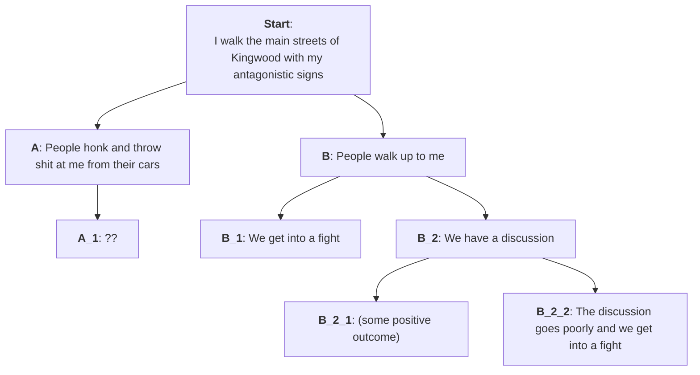

---
tags:
  - Note/WhatToDo
aliases:
  - _template
createdDate: 2026-02-15
---
### I want to learn how to look up current laws, in order to:
 - understand my rights during interactions with law enforcement
 - understand the rules governing local elections
 - understand my right to hear arms
 - etc 

### Would studying criminal justice at the community college level be useful for this ^ ?

Public meeting in Kingwood
 - http://kingwoodassociationmanagement.com/kingwoodmgt/document_view.asp?id=15

---
## 1. What are the rules/laws around carrying signage in public? Where am I freely allowed to carry a sign? What does "in public" mean?
 - see City of Houston section of this document for info on public right-of-way
 - http://kingwoodassociationmanagement.com/kingwoodmgt/document_view.asp?id=15

## 2. What are my rights to bear arms in public?

## 3. What are the rules/laws surrounding making personal threats to people? Is there a legally defensible way to say something like "I want to do you personal harm" or "you deserve an ass whoopin'"?

## 4. Is it legal to enter into a physical altercation with someone if both i and they agree to do so beforehand?

## 5. I'm going to be antagonizing people, and it's reasonable to assume that some of them will want to fight me. What do I need to know regard self defense laws? 

# Flowchart:
This is a diagram outlining how I imagine my interactions with my neighbors might go

