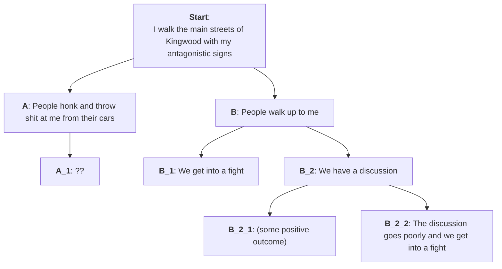

---
tags:
  - Note/WhatToDo
aliases:
  - _template
createdDate: 2026-02-15
---
# Context: 
 - [George Carlin on Politicians](https://youtu.be/07w9K2XR3f0?si=EN45gc7juJO1HF_n)
 - [[What To Do]] 
 - I mean to engage in something I refer to as "perpetual protest" against my neighbors/fellow Americans. That is, a regular campaign of making my thoughts/opinions known to the public l. 
 - I mean to do this in the form of
     - walking around town holding signs
     - attending public meetings 

# Diagram outlining how I imagine my interactions with my neighbors might go

# Questions:
### 1. What are the rules/laws around carrying signage in public? Where am I freely allowed to carry a sign? What does "in public" mean?
 - see City of Houston section of this document for info on public right-of-way
  - http://kingwoodassociationmanagement.com/kingwoodmgt/document_view.asp?id=15
  - HPD Positive Interaction Program meeting 3rd Tuesday 7pm @ 2901 Woodland Hills Drive
 

### 2. What are the rules/laws surrounding making personal threats to people? Is there a legally defensible way to say something like "I want to do you personal harm" or "I'd like to kick your ass for saying that"?

### 3. Is it legal to enter into a physical altercation with someone if both i and they agree to do so beforehand?

### 4. I'm going to be antagonizing people, and it's reasonable to assume that some of them will want to fight me. What do I need to know regard self defense laws? 

### 5. What are my rights to bear arms in public?