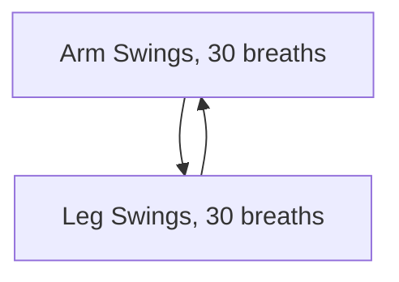

---
tags:
  - Movement/Note
createdDate: "08-02-2025"
---
# Note: 
2026-09-24
On Movement Organization:
Do we focus on only 1 of the following broad movement-type categories? 
 - joint-specific movements
 - the 5 fundamental human movements
 - our strength/movement weak points 
 - the movements prioritized in our goals (carries, squats, KB snatches)

# Note:
Regardless of how we organize our movement practice, we should use the concept of puzzle pieces to build combinable sets/modules of movements. Puzzle pieces are sets of movements that seem to combine well together, OR which we determine should be performed together. 

# Note: 
I think the way to organize things is like so: 
 1. Focus on prioritized/goal movements
 2. then focus on our weakest of the 5 fundamental human movements 
 3. then focus on our weakest joints

# Note
WHEN YOU'RE NOT SURE WHAT TO DO:
 - carries
 - asymmetric work 
 - isometric work 
 - squats

# Note
2026-05-11
Three broad categories of movement training organization: 
 - Every 3rd Day heavy work (Greek "tetras")
 - Daily Movement Quotas
 - Grease The Groove 
     - note: the idea with GTG is to use it to integrate new/unfamiliar movements into our system (example: heavy sandbag work). Currently we GTG primarily with hangs; we should change the GTG movement ever so often.

# Note
2026-05-30
Structure exercise sets around even-numbered sets of breath counts, and perform superset "rounds" like 

# Note: 
I think our movement training practice is beginning to coalesce around 5 organizing patterns: 
 - "every 3rd day"
 - Nessler Pool Protocol
 - [Strong First split sets](https://youtu.be/9m0AZUEvdu0?si=pz3_WGT_vK43XaOW)
 - Tabata Protocol
 - [Inter-set Stretching](https://youtu.be/Q_dpIxaPjK8?si=5mFFZ39OmG0jyahm)

