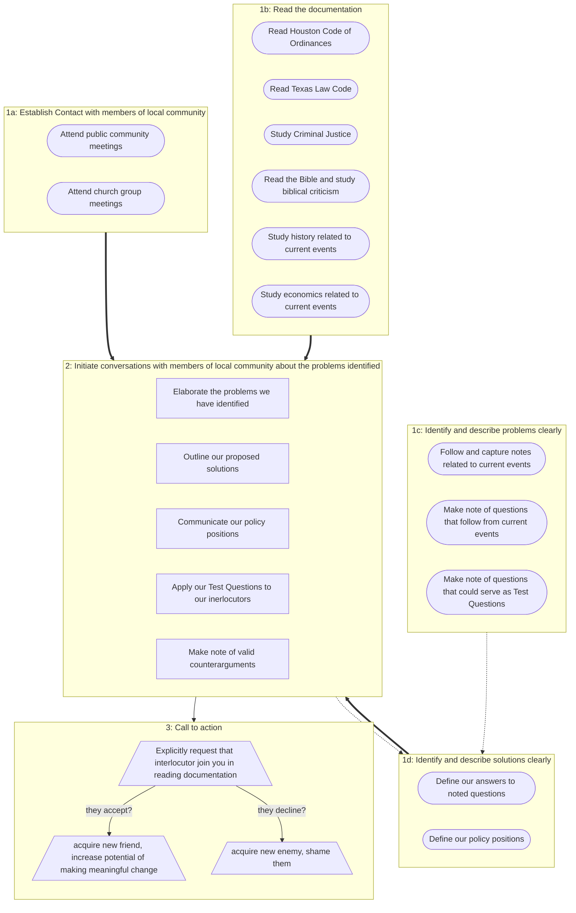

# The Point:

The point of this work is to answer the question
    "What do you do when the government enacts policies that you disagree with?"
Everything we're doing is towards answering this question. When the answering is sufficiently done, then the doing must begin. 

# Relevant Notes: 
```dataview
LIST
FROM #Note/WhatToDo or #Note/HowToBe 
SORT createdDate DESCENDING 
```
# Relevant Plates:
```dataview
TABLE isActive AS "Active?", focusedSource AS "In-Focus Resource", AP
FROM #Plate/WhatToDo
SORT isActive DESC
```

# Illustrative Flowchart


# Log

2026-09-17
Began bringing some order to this note. Added the "The Point:" section, which we will be modifying and clarifying going forward. But as it stands is pretty well captures the work. Also added the "Relevant Plates" section. 

2026-09-12
Added the "Illustrative Flowchart" to put the work we are doing into context, or to connect all of the work we're doing and to highlight the connections. 